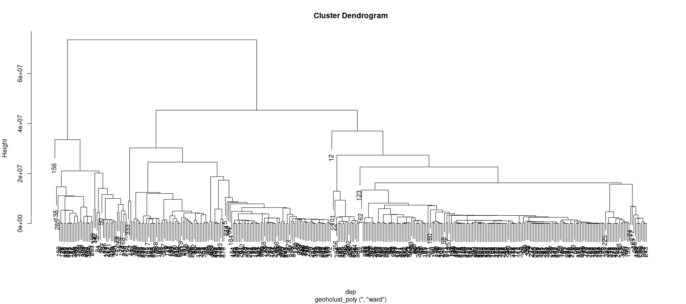
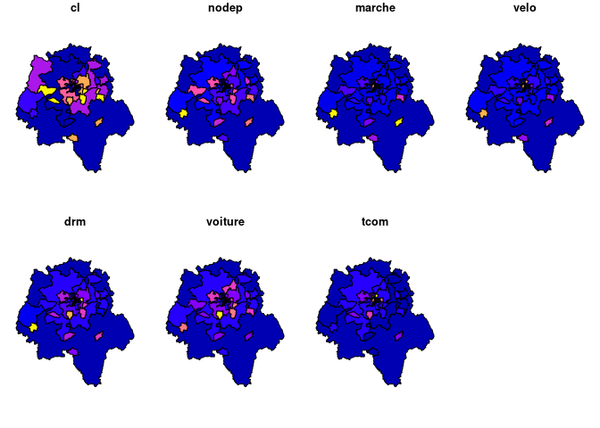

<!-- README.md is generated from README.Rmd. Please edit that file -->

# geohclust

<!-- badges: start -->
<!-- badges: end -->

geohclust offers two functions `?geohclust_poly` and `?geohclust_graph`
that enable the clustering of spatial data such as polygons with a
hclust type approach but taking advantages of contiguity constraints.
The contiguity naturally create a sparsely connected graph that can be
leveraged to speed-up the calculations and deal with more than 30000
polygons in seconds.

## Installation

You can install the development version of geohclust from
[GitHub](https://github.com/) with:

``` r
# install.packages("devtools")
devtools::install_github("comeetie/geohclust")
```

## Example

This is a basic example, we first prepare some spatial polygons data,
here the results at the municipality level in one french department for
the :

``` r
library(geohclust)
library(dplyr)
library(sf)
data("pres2022_t1_communes")
deplist = c(37)
dep = pres2022_t1_communes |> 
  filter(INSEE_DEP %in% deplist) |>
  select(p_gauche,p_droite,p_extreme_droite) |>
  filter(!is.na(p_gauche))
```

Do the clustering and use the classical function from `?hclust`
(`plot.hclust` and `?cutree`):

``` r
hc=geohclust_poly(dep)
plot(hc)
cutree(hc,k=30) |> head(20)
#>  1  2  3  4  5  6  7  8  9 10 11 12 13 14 15 16 17 18 19 20 
#>  1  2  3  3  4  5  2  6  4  7  4  7  4  8  9 10  3 11  8 12
```



You may also use the `?geocutree` function which build directly a
spatial data.frame with the clustering results:

``` r
plot(geocutree(hc,k=30))
```


